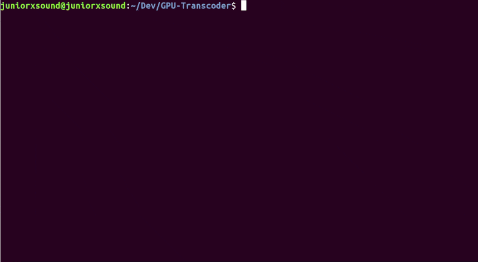

<h1>now</h1>
 

A slim FFMPEG wrapper to easily transcode videos to multiple resolutions using Nvidia GPUs 📼

<a href="#getting-started">Getting started</a>

## Getting started
To quickly get started make sure you have [Docker](https://docs.docker.com/engine/release-notes/) (>=19.03), [Nvidia docker](https://github.com/NVIDIA/nvidia-docker) and make installed.
- Clone the respository and `cd` into it - `git clone https://github.com/juniorxsound/now.git && cd now`
- Build the Docker image by running `make setup`
- Download the Big Buck Bunny test video by running `make download`
- Build the program by running `make build`
- Run the program by running `make run`

If everything went well you should have 4 transcoded versions of the video in `video/transcode/`

For a simple example look at [`main.cpp`](https://github.com/juniorxsound/now/blob/master/src/main.cpp)
